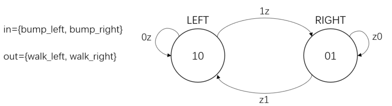
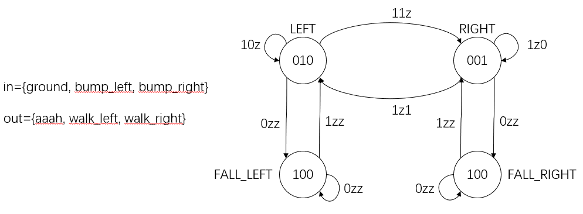
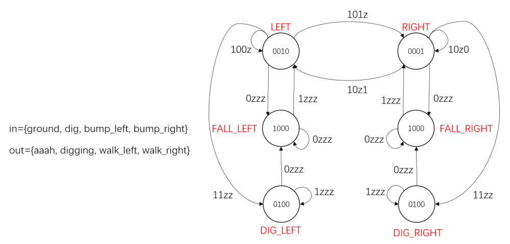
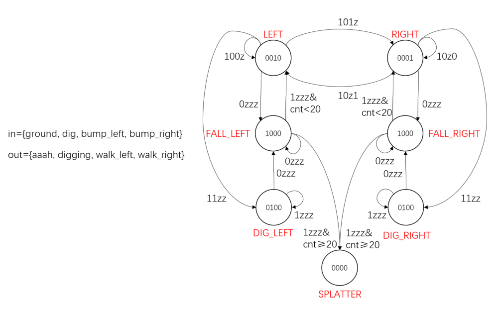

# HDLBits

## Getting Started

1. Step one

   ```verilog
   module top_module( output one );
       
   // Insert your code here
       assign one = 1;
       
   endmodule
   ```

2. Zero

   ```verilog
   module top_module(
       output zero
       
   );// Module body starts after semicolon
   	assign zero = 0;
       
   endmodule
   ```

## Verilog Language

### Basics

1. Wire

   ```verilog
   module top_module( input in, output out );
       
   	assign out = in;
       
   endmodule
   ```

2. Wire4

   ```verilog
   module top_module( 
       input a,b,c,
       output w,x,y,z );
       
       assign {w, x, y, z} = {a, b, b, c};
       
   endmodule
   ```

3. Notgate

   ```verilog
   module top_module( input in, output out );
       
   	assign out = ~in;
       
   endmodule
   ```

4. Andgate

   ```verilog
   module top_module( 
       input a, 
       input b, 
       output out );
       
   	assign out = a&b;
       
   endmodule
   ```

5. Norgate

   ```verilog
   module top_module( 
       input a, 
       input b, 
       output out );
       
       assign out = ~(a|b);
       
   endmodule
   ```

6. Xnorgate

   ```verilog
   module top_module( 
       input a, 
       input b, 
       output out );
       
       assign out = ~(a^b);
       
   endmodule
   ```

7. Wire decl

   ```verilog
   module top_module(
       input a,
       input b,
       input c,
       input d,
       output out,
       output out_n   ); 
       
   	wire a_b, c_d, f;
       
       assign {a_b, c_d} = {a&b, c&d};
       assign f = a_b|c_d;
       assign {out, out_n} = {f, ~f};
   
   endmodule
   ```

8. 7458

   ```verilog
   module top_module ( 
       input p1a, p1b, p1c, p1d, p1e, p1f,
       output p1y,
       input p2a, p2b, p2c, p2d,
       output p2y );
       
   	wire p11,p12,p21,p22;
       
       assign {p11, p12} = {p1a&p1b&p1c, p1d&p1e&p1f};
       assign p1y = p11|p12;
       assign {p21, p22} = {p2a&p2b, p2d&p2c};
       assign p2y = p21|p22;
   
   endmodule
   ```

### Vectors

1. Vector0

   ```verilog
   module top_module ( 
       input wire [2:0] vec,
       output wire [2:0] outv,
       output wire o2,
       output wire o1,
       output wire o0  ); // Module body starts after module declaration
       
   	assign outv = vec;
       assign o2 = vec[2];
       assign o1 = vec[1];
       assign o0 = vec[0];
       
   endmodule
   ```

   * 声明vector时格式应如下：

     ```verilog
     wire[3:0] vec; // 不是wire vec[3:0];
     ```

   * 赋值时注意位数

2. Vector1

   ```verilog
   `default_nettype none     // Disable implicit nets. Reduces some types of bugs.
   module top_module( 
       input wire [15:0] in,
       output wire [7:0] out_hi,
       output wire [7:0] out_lo );
       
       assign out_hi = in[15:8];
       assign out_lo = in[7:0];
       
   endmodule
   ```

   * 声明vector时可以自定义最高位（:前）~最低位（:后），可以不为0，可以为负，大小端可以自定义
   * 引用时必须从高位到低位引用，如声明b[7:0]则引用为b[4:0]，声明b[0:7]则引用为b[7:4]

3. Vector2

   ```verilog
   module top_module( 
       input [31:0] in,
       output [31:0] out );//
   
       // assign out[31:24] = ...;
       assign out[31:24] = in[7:0];
       assign out[23:16] = in[15:8];
       assign out[15:8] = in[23:16];
       assign out[7:0] = in[31:24];
       
   endmodule
   ```

4. Vectorgates

   ```verilog
   module top_module( 
       input [2:0] a,
       input [2:0] b,
       output [2:0] out_or_bitwise,
       output out_or_logical,
       output [5:0] out_not
   );
       
   	assign out_or_bitwise = a|b;
       assign out_or_logical = a||b;
       assign out_not[2:0] = ~a;
       assign out_not[5:3] = ~b;
       
   endmodule
   ```

   * &，|，\^位操作，&&，||逻辑操作

5. Gates4

   ```verilog
   module top_module( 
       input [3:0] in,
       output out_and,
       output out_or,
       output out_xor
   );
       
   	assign out_and = & in;
       assign out_or = | in;
       assign out_xor = ^ in;
       
   endmodule
   ```

   * 单目运算符&，|，\^可以用来对整个vector操作如下：

     ```verilog
     & vec; // 与
     | vec; // 或
     ^ vec; // 异或
     ```

6. Vector3

   ```verilog
   module top_module (
       input [4:0] a, b, c, d, e, f,
       output [7:0] w, x, y, z );//
   
       // assign { ... } = { ... };
       wire [31:0]all;
       
       assign all = {a,b,c,d,e,f,2'b11};
       assign {w,x,y,z} = all;
       
   endmodule
   ```

   * 串联操作符{}可以将它们按顺序构成从高到低的vector，可以是单个元素（如3‘b111）也可以是vector（如vec[3:0]）

7. Vectorr

   ```verilog
   module top_module( 
       input [7:0] in,
       output [7:0] out
   );
       
       assign out = {in[0],in[1],in[2],in[3],in[4],in[5],in[6],in[7]};
       
   endmodule
   ```

8. Vector4

   ```verilog
   module top_module (
       input [7:0] in,
       output [31:0] out );//
   
       // assign out = { replicate-sign-bit , the-input };
       assign out = {{24{in[7]}}, in[7:0]};
       
   endmodule
   ```

   * 串联操作接受如下格式的数据：

     ```verilog
     {3'b111, 4'ha, 4'd10, vec[7:0], {5{1'b1}, 2{a, b, c}}}
     //立即数，vector，num{vector}表示重复num次的vector
     ```

9. Vector5

   ```verilog
   module top_module (
       input a, b, c, d, e,
       output [24:0] out );//
   
       // The output is XNOR of two vectors created by 
       // concatenating and replicating the five inputs.
       // assign out = ~{ ... } ^ { ... };
       assign out = ~{{5{a}}, {5{b}}, {5{c}}, {5{d}}, {5{e}}} ^ {5{a, b, c, d, e}};
       
   endmodule
   ```

### Modules:Hierarchy

1. Module

   ```verilog
   module top_module ( input a, input b, output out );
       
       mod_a m(a, b, out);
       
   endmodule
   ```

   * 两种引用格式如下：

     ```verilog
     mod_a inst(wa, wb, wc); // 位置需要对应
     mod_a inst(.a(wa), .b(b), .c(c));
     ```

2. Module pos

   ```verilog
   module top_module ( 
       input a, 
       input b, 
       input c,
       input d,
       output out1,
       output out2
   );
       
       mod_a m(out1, out2, a,b,c,d);
       
   endmodule
   ```

3. Module name

   ```verilog
   module top_module ( 
       input a, 
       input b, 
       input c,
       input d,
       output out1,
       output out2
   );
       
       mod_a m(.out1(out1), .out2(out2), .in1(a), .in2(b), .in3(c), .in4(d));
       
   endmodule
   ```

4. Module shift

   ```verilog
   module top_module ( input clk, input d, output q );
       
   	wire q1,q2;
       
       my_dff m1(.clk(clk), .d(d), .q(q1));
       my_dff m2(.clk(clk), .d(q1), .q(q2));
       my_dff m3(.clk(clk), .d(q2), .q(q));
       
   endmodule
   ```

5. Module shift8

   ```verilog
   module top_module ( 
       input clk, 
       input [7:0] d, 
       input [1:0] sel, 
       output [7:0] q 
   );
       
       wire[7:0] q1,q2,q3;
       
   	my_dff8 m1(.clk(clk), .d(d), .q(q1));
       my_dff8 m2(.clk(clk), .d(q1), .q(q2));
       my_dff8 m3(.clk(clk), .d(q2), .q(q3));
       
       always @(*)
           begin
               case(sel)
                   2'b00:q=d;
                   2'b01:q=q1;
                   2'b10:q=q2;
                   2'b11:q=q3;
               endcase
           end
       
   endmodule
   ```

6. Module add

   ```verilog
   module top_module(
       input [31:0] a,
       input [31:0] b,
       output [31:0] sum
   );
       
       wire cout;
       
       add16 a1(.cin(0), .a(a[15:0]), .b(b[15:0]), .sum(sum[15:0]), .cout(cout));
       add16 a2(.cin(cout), .a(a[31:16]), .b(b[31:16]), .sum(sum[31:16]));
       
   endmodule
   ```

7. Module fadd

   ```verilog
   module top_module (
       input [31:0] a,
       input [31:0] b,
       output [31:0] sum
   );//
       
   	wire cout;
       
       add16 a1(.cin(0), .a(a[15:0]), .b(b[15:0]), .sum(sum[15:0]), .cout(cout));
       add16 a2(.cin(cout), .a(a[31:16]), .b(b[31:16]), .sum(sum[31:16]));
       
   endmodule
   
   module add1 ( input a, input b, input cin,   output sum, output cout );
   
   // Full adder module here
       wire[1:0] s;
       
       assign s = a+b+cin;
       assign {cout, sum} = s;
       
   endmodule
   ```

8. Module cseladd

   ```verilog
   module top_module(
       input [31:0] a,
       input [31:0] b,
       output [31:0] sum
   );
       
   	wire cout;
       wire[15:0] sum0,sum1;
       
       add16 a1(.cin(0), .a(a[15:0]), .b(b[15:0]), .sum(sum[15:0]), .cout(cout));
       add16 a2(.cin(0), .a(a[31:16]), .b(b[31:16]), .sum(sum0));
       add16 a3(.cin(1), .a(a[31:16]), .b(b[31:16]), .sum(sum1));
       
       always @(*)
           begin
               case(cout)
                   1'b0:sum[31:16] = sum0;
                   1'b1:sum[31:16] = sum1;
               endcase
           end
               
   endmodule
   ```

9. Module addsub

   ```verilog
   module top_module(
       input [31:0] a,
       input [31:0] b,
       input sub,
       output [31:0] sum
   );
       
   	wire cout;
       wire[31:0] bb;
       
       assign bb = b^{32{sub}};
       add16 a1(.cin(sub), .a(a[15:0]), .b(bb[15:0]), .sum(sum[15:0]), .cout(cout));
       add16 a2(.cin(cout), .a(a[31:16]), .b(bb[31:16]), .sum(sum[31:16]));
       
   endmodule
   ```

### Procedures

1. Alwaysblock1

   ```verilog
   // synthesis verilog_input_version verilog_2001
   module top_module(
       input a, 
       input b,
       output wire out_assign,
       output reg out_alwaysblock
   );
       
   	assign out_assign = a&b;
       
       always@ (*)
           out_alwaysblock = a&b;
       
   endmodule
   ```

   * always @()组合块和assign描述相同的电路
   * assign的左值必须为wire；always语句的左值必须是reg

2. Alwaysblock2

   ```verilog
   // synthesis verilog_input_version verilog_2001
   module top_module(
       input clk,
       input a,
       input b,
       output wire out_assign,
       output reg out_always_comb,
       output reg out_always_ff   );
       
   	assign out_assign = a^b;
       
       always@ (*)
           out_always_comb = a^b;
       
       always @(posedge clk)
           out_always_ff <=a^b;
       
   endmodule
   ```

   * 三种赋值方式如下：

     ```verilog
     assign x = y; // 只能在always外使用
     x = y; // 阻塞赋值在always中使用，组合块
     x <= y; // 非阻塞赋值在always中使用，时序块
     ```

3. Always if

   ```verilog
   // synthesis verilog_input_version verilog_2001
   module top_module(
       input a,
       input b,
       input sel_b1,
       input sel_b2,
       output wire out_assign,
       output reg out_always   ); 
       
       always @(*) begin
           if (sel_b1&sel_b2) begin
               out_always = b;
           end
           else begin
               out_always = a;
           end
       end
       
       assign out_assign = (sel_b1&sel_b2)?b:a;
   
   endmodule
   ```

4. Always if2

   ```verilog
   // synthesis verilog_input_version verilog_2001
   module top_module (
       input      cpu_overheated,
       output reg shut_off_computer,
       input      arrived,
       input      gas_tank_empty,
       output reg keep_driving  ); //
   
       always @(*) begin
           if (cpu_overheated)
              shut_off_computer = 1;
           else
               shut_off_computer = 0;
       end
   
       always @(*) begin
           if (~arrived)
              keep_driving = ~gas_tank_empty;
           else
               keep_driving = 0;
       end
   
   endmodule
   ```

   * 为了避免不正确的锁存器，组合电路需要在所有条件下为输出分配一个值

5. Always case

   ```verilog
   // synthesis verilog_input_version verilog_2001
   module top_module ( 
       input [2:0] sel, 
       input [3:0] data0,
       input [3:0] data1,
       input [3:0] data2,
       input [3:0] data3,
       input [3:0] data4,
       input [3:0] data5,
       output reg [3:0] out   );//
   
       always@(*) begin  // This is a combinational circuit
           case(sel)
               3'b000: out = data0;
               3'b001: out = data1;
               3'b010: out = data2;
               3'b011: out = data3;
               3'b100: out = data4;
               3'b101: out = data5;
               default: out = 0;
           endcase
       end
   
   endmodule
   ```

   * case语句每个事例项中只能执行一个语句，必要时使用begin end

   * case语句允许重叠项，并执行第一个匹配项

   * case语句使用default作为无匹配时的默认项

     ```verilog
     case (sel)
         1'b0:begin
             ...
         end
         1'b1:begin
             ...
         end
         default:begin
             ...
         end
     endcase
     ```

6. Always case2

   ```verilog
   // synthesis verilog_input_version verilog_2001
   module top_module (
       input [3:0] in,
       output reg [1:0] pos  );
       
       always @(*) begin
           casex(in)
           	4'bxxx1: pos = 0;
           	4'bxx10: pos = 1;
           	4'bx100: pos = 2;
           	4'b1000: pos = 3;
           	default: pos = 0;
           endcase
       end
   
   endmodule
   ```

7. Always casez

   ```verilog
   // synthesis verilog_input_version verilog_2001
   module top_module (
       input [7:0] in,
       output reg [2:0] pos );
       
       always @(*) begin
           casez(in)
               8'bzzzzzzz1: pos = 0;
               8'bzzzzzz10: pos = 1;
               8'bzzzzz100: pos = 2;
               8'bzzzz1000: pos = 3;
               8'bzzz10000: pos = 4;
               8'bzz100000: pos = 5;
               8'bz1000000: pos = 6;
               8'b10000000: pos = 7;
               default: pos = 0;
           endcase
       end
   
   endmodule
   ```

   * casez将匹配时不关心的值设定为z值，或?值
   * casex类似，将x和z均视为不关心
   * 在指定时，显式地将一些值确定可以避免因位置调换等引起的错误

8. Always nolatches

   ```verilog
   // synthesis verilog_input_version verilog_2001
   module top_module (
       input [15:0] scancode,
       output reg left,
       output reg down,
       output reg right,
       output reg up  ); 
       
       always @(*) begin
           left = 0; down = 0; right = 0; up = 0; 
           case(scancode)
               16'he06b: left = 1;
               16'he072: down = 1;
               16'he074: right = 1;
               16'he075: up = 1;
           endcase
       end
   
   endmodule
   ```

   * 为了避免产生锁存器，必须为所有条件下的输出分配值；同时为了避免大量的代码冗余，可以在case前为输出分配一个默认值进行初始化

### More Verilog Features

1. Conditional

   ```verilog
   module top_module (
       input [7:0] a, b, c, d,
       output [7:0] min);//
   
       // assign intermediate_result1 = compare? true: false;
       wire[7:0] r1,r2;
       
       assign r1 = (a<b)?a:b;
       assign r2 = (r1<c)?r1:c;
       assign min = (r2<d)?r2:d;
       
   endmodule
   ```

   * 三目运算符condition?if_true:if_false将在condition正确时执行if_true否则if_false

2. Reduction

   ```verilog
   module top_module (
       input [7:0] in,
       output parity); 
       
   	assign parity = ^in;
       
   endmodule
   ```

   * 单目运算符&,|,\^对一个vector中的所有位执行相应运算

3. Gates100

   ```verilog
   module top_module( 
       input [99:0] in,
       output out_and,
       output out_or,
       output out_xor 
   );
       
   	assign out_and = &in;
       assign out_or = |in;
       assign out_xor = ^in;
       
   endmodule
   ```

4. Vector100r

   ```verilog
   module top_module( 
       input [99:0] in,
       output [99:0] out
   );
       
       always @(*) begin
           for (integer i=0;i<100;i=i+1) begin
               out[i] = in[99-i]; 
           end
       end
       
   endmodule
   ```

5. Popcount255

   ```verilog
   module top_module( 
       input [254:0] in,
       output [7:0] out );
       
       integer i;
       
       always @(*) begin
           out = 0;
           for(i=0;i<255;i++) begin
               out += in[i];
           end
       end
       
   endmodule
   ```

6. Adder100i

   ```verilog
   module top_module( 
       input [99:0] a, b,
       input cin,
       output [99:0] cout,
       output [99:0] sum );
       
   	integer i;
       
       always @(*) begin
           for(i=0;i<100;i++) begin
               {cout[i], sum[i]} = (i == 0)?(a[i] + b[i] + cin):(a[i] + b[i] + cout[i-1]);
           end
       end
       
   endmodule
   ```

7. Bcdadd100

   ```verilog
   module top_module( 
       input [399:0] a, b,
       input cin,
       output cout,
       output [399:0] sum );
       
       genvar i;
       reg[99:0] temp;
       
       initial begin
           cout = 0;
           temp = 0;
       end
       
       generate
           for (i=0;i<100;i++) begin:genblock
               if (i == 0) begin
                   bcd_fadd bcdadd(.a(a[4*i+3:4*i]), .b(b[4*i+3:4*i]), .cin(cin), .cout(temp[i]), .sum(sum[4*i+3:4*i]));
               end
               else begin
                   bcd_fadd bcdadd(.a(a[4*i+3:4*i]), .b(b[4*i+3:4*i]), .cin(temp[i-1]), .cout(temp[i]), .sum(sum[4*i+3:4*i]));
               end
           end
       endgenerate
       
       assign cout = temp[99];
       
   endmodule
   ```

   * 不能integer作为多位索引中的变量，即a[i:0]这种格式是不允许的

   * 声明genvar索引变量，并使用如下定义的generate块来进行多位循环：

     ```verilog
     genvar i;
     
     generate
         for(...):genblock //需要定义模块名字
             ...
             
     endgenerate
     ```

   * 同一个变量在实例调用时只能传递到一个参数上，add add_1(.a(a), .b(a), .s(s))是不允许的


## Circuits

### Combinational Logic

#### Basic Gates

1. Wire

   ```verilog
   module top_module (
       input in,
       output out);
       
       assign out = in;
       
   endmodule
   ```

2. Exams/m2014 q4i

   ```verilog
   module top_module (
       output out);
       
   	assign out = 0;
       
   endmodule
   ```

3. Exams/m2014 q4e

   ```verilog
   module top_module (
       input in1,
       input in2,
       output out);
       
       assign out = ~(in1 | in2);
   
   endmodule
   ```

4. Exams/m2014 q4f

   ```verilog
   module top_module (
       input in1,
       input in2,
       output out);
   	
       assign out = in1&(~in2);
       
   endmodule
   ```

5. Exams/m2014 q4g

   ```verilog
   module top_module (
       input in1,
       input in2,
       input in3,
       output out);
       
       wire out_nxor;
       
       assign out_nxor = ~(in1^in2);
       assign out = in3^out_nxor;
   
   endmodule
   ```

6. Gates

   ```verilog
   module top_module( 
       input a, b,
       output out_and,
       output out_or,
       output out_xor,
       output out_nand,
       output out_nor,
       output out_xnor,
       output out_anotb
   );
       
       assign {out_and, out_or, out_xor, out_nand, out_nor, out_xnor, out_anotb} = {a&b, a|b, a^b, ~(a&b), ~(a|b), ~(a^b), a&(~b)};
       
   endmodule
   ```

7. 7420

   ```verilog
   module top_module ( 
       input p1a, p1b, p1c, p1d,
       output p1y,
       input p2a, p2b, p2c, p2d,
       output p2y );
   
       assign {p1y, p2y} = {~(p1a&p1b&p1c&p1d), ~(p2a&p2b&p2c&p2d)};
   
   endmodule
   ```

8. Truthtable1

   ```verilog
   module top_module( 
       input x3,
       input x2,
       input x1,  // three inputs
       output f   // one output
   );
   
       assign f = (~x3&x2&x1) | (~x3&x2&~x1) | (x3&~x2&x1) | (x3&x2&x1);
       
   endmodule
   ```

   * sum-of-product或product-of-sum化简真值表

9. Mt2015 eq2

   ```verilog
   module top_module ( input [1:0] A, input [1:0] B, output z ); 
       
       assign z = (A == B)?1:0;
   
   endmodule
   ```

10. Mt2015 q4a

    ```verilog
    module top_module (input x, input y, output z);
        
        assign z = (x^y) & x;
    
    endmodule
    ```

11. Mt2015 q4b

    ```verilog
    module top_module ( input x, input y, output z );
        
        assign z = ~(x^y);
    
    endmodule
    ```

12. Mt 2015 q4

    ```verilog
    module top_module (input x, input y, output z);
        
        wire za1, za2, zb1, zb2;
        
        mod_a a1(.x(x), .y(y), .z(za1));
        mod_b b1(.x(x), .y(y), .z(zb1));
        mod_a a2(.x(x), .y(y), .z(za2));
        mod_b b2(.x(x), .y(y), .z(zb2));
        
        assign z = (za1|zb1) ^ (za2&zb2);
    
    endmodule
    
    module mod_a(input x, input y, output z);
        assign z = (x^y) & x;
    endmodule
    
    module mod_b(input x, input y, output z);
        assign z = ~(x^y);
    endmodule
    ```

13. Ringer

    ```verilog
    module top_module (
        input ring,
        input vibrate_mode,
        output ringer,       // Make sound
        output motor         // Vibrate
    );
        
        // 振动模式不响铃，响铃模式不振动
        assign ringer = ring?(vibrate_mode?0:1):0;
        assign motor = ring?(vibrate_mode?1:0):0;
    
    endmodule
    ```

14. Thermostat

    ```verilog
    module top_module (
        input too_cold,
        input too_hot,
        input mode,
        input fan_on,
        output heater,
        output aircon,
        output fan
    ); 
        
        // 在对应模式下制冷/热才会在高于阈值时开启，风扇也可以手动开启
        assign heater = mode&too_cold;
        assign aircon = ~mode&too_hot;
        assign fan = heater|aircon|fan_on;
    
    endmodule
    ```

15. Popcount3

    ```verilog
    module top_module( 
        input [2:0] in,
        output [1:0] out );
        
        assign out = in[0] + in[1] + in[2];
    
    endmodule
    ```

16. Gatesv

    ```verilog
    module top_module( 
        input [3:0] in,
        output [2:0] out_both,
        output [3:1] out_any,
        output [3:0] out_different );
        
        always @(*) begin
            for (int i=0;i<3;i++) begin
                out_both[i] = in[i]&in[i+1];
                out_any[i+1] = in[i]|in[i+1];
                out_different[i] = in[i]^in[i+1];
            end
            out_different[3] = in[3]^in[0];
        end
    
    endmodule
    ```

17. Gatesv100

    ```verilog
    module top_module( 
        input [99:0] in,
        output [98:0] out_both,
        output [99:1] out_any,
        output [99:0] out_different );
        
        always @(*) begin
            for (int i=0;i<99;i++) begin
                out_both[i] = in[i]&in[i+1];
                out_any[i+1] = in[i]|in[i+1];
                out_different[i] = in[i]^in[i+1];
            end
            out_different[99] = in[99]^in[0];
        end
    
    endmodule
    ```

    * 用assign和串联操作实现如下：

      ```verilog
      module top_module (
      	input [99:0] in,
      	output [98:0] out_both,
      	output [99:1] out_any,
      	output [99:0] out_different
      );
      
      	// See gatesv for explanations.
      	assign out_both = in & in[99:1];
      	assign out_any = in[99:1] | in ;
      	assign out_different = in ^ {in[0], in[99:1]};
      	
      endmodule
      ```

#### Multiplexers

1. Mux2to1

   ```verilog
   module top_module( 
       input a, b, sel,
       output out ); 
       
       assign out = (sel == 1)?b:a;
   
   endmodule
   ```

2. Mux2to1v

   ```verilog
   module top_module( 
       input [99:0] a, b,
       input sel,
       output [99:0] out );
       
       assign out = (sel == 1)?b:a;
   
   endmodule
   ```

3. Mux9to1v

   ```verilog
   module top_module( 
       input [15:0] a, b, c, d, e, f, g, h, i,
       input [3:0] sel,
       output [15:0] out );
       
       always @(*) begin
           case (sel)
           	4'd0: out=a;
           	4'd1: out=b;
           	4'd2: out=c;
           	4'd3: out=d;
           	4'd4: out=e;
           	4'd5: out=f;
           	4'd6: out=g;
           	4'd7: out=h;
           	4'd8: out=i;
           	default: out=16'b1111111111111111;
       	endcase
       end
       
   endmodule
   ```

   * 全1可以表示为：

     ```verilog
     '1 // 所有位为1
     '0 // 所有位为0
     'x // 所有位为x
     'z // 所有位为z
     ```

4. Mux256to1

   ```verilog
   module top_module( 
       input [255:0] in,
       input [7:0] sel,
       output out );
       
       assign out = in[sel];
   
   endmodule
   ```

5. Mux356to1v

   ```verilog
   module top_module( 
       input [1023:0] in,
       input [7:0] sel,
       output [3:0] out );
       
       assign out[0] = in[sel*4];
       assign out[1] = in[sel*4+1];
       assign out[2] = in[sel*4+2];
       assign out[3] = in[sel*4+3];
   
   endmodule
   ```

#### Arithmetic Logic

1. Hadd

   ```verilog
   module top_module( 
       input a, b,
       output cout, sum );
       
       assign {cout, sum} = {a&b, a^b};
   
   endmodule
   ```

2. Fadd

   ```verilog
   module top_module( 
       input a, b, cin,
       output cout, sum );
       
       assign {cout, sum} = a+b+cin;
   
   endmodule
   ```

3. Adder3

   ```verilog
   module top_module( 
       input [2:0] a, b,
       input cin,
       output [2:0] cout,
       output [2:0] sum );
       
       full_adder add1(.a(a[0]), .b(b[0]), .cin(cin), .cout(cout[0]), .sum(sum[0]));
       full_adder add2(.a(a[1]), .b(b[1]), .cin(cout[0]), .cout(cout[1]), .sum(sum[1]));
       full_adder add3(.a(a[2]), .b(b[2]), .cin(cout[1]), .cout(cout[2]), .sum(sum[2]));
   
   endmodule
   
   module full_adder( 
       input a, b, cin,
       output cout, sum );
       
       assign {cout, sum} = a+b+cin;
       
   endmodule
   ```

4. Exams/m2014 q4j

   ```verilog
   module top_module (
       input [3:0] x,
       input [3:0] y, 
       output [4:0] sum);
       
       assign sum = x + y;
   
   endmodule
   ```

5. Exams/ece241 2014 q1c

   ```verilog
   module top_module (
       input [7:0] a,
       input [7:0] b,
       output [7:0] s,
       output overflow
   ); //
       
       wire[7:0] sum_in;
       wire[8:0] sum_out;
    
       // assign s = ...
       // assign overflow = ...
       assign sum_in = a[6:0] + b[6:0];
       assign sum_out = a + b;
       assign s = sum_out;
       assign overflow = (sum_in[7] == sum_out[8])?0:1;
   
   endmodule
   ```

   * 应该考虑两种情况，两数均为正产生负数和两数均为负产生正数：

     ```verilog
     a[7] & b[7] & ~s[7] // 正加正为负 溢出
     ~a[7] & ~b[7] & s[7] // 负加负为正 溢出
     ```

6. Adder100

   ```verilog
   module top_module( 
       input [99:0] a, b,
       input cin,
       output cout,
       output [99:0] sum );
       
       assign{cout, sum} = a + b + cin;
   
   endmodule
   ```

7. Bcdadd4

   ```verilog
   module top_module ( 
       input [15:0] a, b,
       input cin,
       output cout,
       output [15:0] sum );
       
       wire couttemp[3:0];
       genvar i;
       
       generate
           for (i=0;i<4;i++) begin: fourbitadd
               if (i==0) begin
                   bcd_fadd add(.a(a[4*i+3:4*i]), .b(b[4*i+3:4*i]), .cin(cin), .cout(couttemp[i]), .sum(sum[4*i+3:4*i]));
               end
           	else begin
                   bcd_fadd add(.a(a[4*i+3:4*i]), .b(b[4*i+3:4*i]), .cin(couttemp[i-1]), .cout(couttemp[i]), .sum(sum[4*i+3:4*i]));
               end
           end
       endgenerate
       assign cout = couttemp[3];
   
   endmodule
   ```

#### Karnaugh Map to Circuit

1. Kmap1

   ```verilog
   module top_module(
       input a,
       input b,
       input c,
       output out  ); 
       
       assign out = a|b|c;
   
   endmodule
   ```

2. Kmap2

   ```verilog
   module top_module(
       input a,
       input b,
       input c,
       input d,
       output out  ); 
       
       assign out = (~a|~b|c) & (~b|c|~d) & (a|b|~c|~d) & (~a|~c|d);
   
   endmodule
   ```

3. Kmap3

   ```verilog
   module top_module(
       input a,
       input b,
       input c,
       input d,
       output out  ); 
       
       assign out = a | (~b&c);
   
   endmodule
   ```

4. Kmap4

   ```verilog
   module top_module(
       input a,
       input b,
       input c,
       input d,
       output out  ); 
       
       assign out = (~a&b&~c&~d) | (a&~b&~c&~d) | (~a&~b&~c&d) | (a&b&~c&d) | (~a&b&c&d) | (a&~b&c&d) | (~a&~b&c&~d) | (a&b&c&~d);
   
   endmodule
   ```

5. Exams/ece241 2013 q2

   ```verilog
   module top_module (
       input a,
       input b,
       input c,
       input d,
       output out_sop,
       output out_pos
   ); 
       
       assign out_sop = (c&d) | (~a&~b&c);
       assign out_pos = (c) & (~b|d) & (~a|d);
   
   endmodule
   ```

6. Exams/m2014 q3

   ```verilog
   module top_module (
       input [4:1] x, 
       output f );
       
       assign f = (~x[1]&x[3]) | (x[2]&~x[3]&x[4]);
   
   endmodule
   ```

7. Exams/2012 q1g

   ```verilog
   module top_module (
       input [4:1] x,
       output f
   ); 
       
       assign f = (~x[1]&x[3]) | (~x[2]&~x[4]) | (x[2]&x[3]&x[4]);
   
   endmodule
   ```

8. Exams/ece241 2014 q3

   ```verilog
   module top_module (
       input c,
       input d,
       output [3:0] mux_in
   ); 
       
       assign mux_in[0] = c | d;
       assign mux_in[1] = 0;
       assign mux_in[2] = ~d;
       assign mux_in[3] = c & d;
   
   endmodule
   ```

### Sequential Logic

#### Latches and Flip-Flops

1. Dff

   ```verilog
   module top_module (
       input clk,    // Clocks are used in sequential circuits
       input d,
       output reg q );//
   
       // Use a clocked always block
       //   copy d to q at every positive edge of clk
       //   Clocked always blocks should use non-blocking assignments
       always@ (posedge clk) begin
          q <= d; 
       end
   
   endmodule
   ```

2. Dff8

   ```verilog
   module top_module (
       input clk,
       input [7:0] d,
       output [7:0] q
   );
       
       always@ (posedge clk) begin
           q <= d;
       end
   
   endmodule
   ```

3. Dff8r

   ```verilog
   module top_module (
       input clk,
       input reset,            // Synchronous reset
       input [7:0] d,
       output [7:0] q
   );
       
       always@ (posedge clk) begin
           if(reset) q <= 0;
           else q <= d;
       end
   
   endmodule
   ```

4. Dff8p

   ```verilog
   module top_module (
       input clk,
       input reset,
       input [7:0] d,
       output [7:0] q
   );
       
       always@ (negedge clk) begin
           if(reset) q <= 8'h34;
           else q <= d;
       end
   
   endmodule
   ```

5. Dff8ar

   ```verilog
   module top_module (
       input clk,
       input areset,   // active high asynchronous reset
       input [7:0] d,
       output [7:0] q
   );
       
       always@ (posedge clk, posedge areset) begin
           if(areset) q <= 0;
           else q <= d;
       end
   
   endmodule
   ```

   * 异步复位通过将复位信号作为always敏感信号实现

6. Dff16e

   ```verilog
   module top_module (
       input clk,
       input resetn,
       input [1:0] byteena,
       input [15:0] d,
       output [15:0] q
   );
       
       always@ (posedge clk) begin
           if(~resetn) q <= 0;
           else begin
               if(byteena[0]) q[7:0] <= d[7:0];
               if(byteena[1]) q[15:8] <= d[15:8];
           end
       end
   
   endmodule
   ```

7. Exams/m2014 q4a

   ```verilog
   module top_module (
       input d, 
       input ena,
       output q);
       
       always@ (*) begin
           if(ena) q = d; 
       end
   
   endmodule
   ```

8. Exams/m2014 q4b

   ```verilog
   module top_module (
       input clk,
       input d, 
       input ar,   // asynchronous reset
       output q);
       
       always@ (posedge clk or posedge ar) begin
           if(ar) q <= 0;
           else q <= d;
       end
   
   endmodule
   ```

9. Exams/m2014 q4c

   ```verilog
   module top_module (
       input clk,
       input d, 
       input r,   // synchronous reset
       output q);
       
       always@ (posedge clk) begin
           if(r) q <= 0;
           else q <= d;
       end
   
   endmodule
   ```

10. Exams/2014 q4d

   ```verilog
   module top_module (
       input clk,
       input in, 
       output out);
       
       wire d;
       
       assign d = in ^ out;
       always@ (posedge clk) begin
           out <= d;
       end
   
   endmodule
   ```

11. Mt2015 muxdff

    ```verilog
    module top_module (
    	input clk,
    	input L,
    	input r_in,
    	input q_in,
    	output reg Q);
        
        wire d;
        assign d = L?r_in:q_in;
        always@ (posedge clk) begin
            Q <= d;
        end
    
    endmodule
    ```

12. Exams/2014 q4a

    ```verilog
    module top_module (
        input clk,
        input w, R, E, L,
        output Q
    );
        
        wire e1, d;
        assign {e1, d} = {E?w:Q, L?R:e1};
        always@ (posedge clk) begin
           Q <= d; 
        end
    
    endmodule
    ```

13. Exams/ece241 2014 q4

    ```verilog
    module top_module (
        input clk,
        input x,
        output z
    ); 
        
        wire d1, d2, d3, q1, q2, q3;
        assign {d1, d2, d3} = {x ^ q1, x & ~q2, x | ~q3};
        always@ (posedge clk) begin
            q1 <= d1;
            q2 <= d2;
            q3 <= d3;
        end
        assign z = ~(q1|q2|q3);
    
    endmodule
    ```

14. Exams/ece241 2013 q7

    ```verilog
    module top_module (
        input clk,
        input j,
        input k,
        output Q); 
        
        always@ (posedge clk) begin
            case({j, k})
                2'b00: Q <= Q;
                2'b01: Q <= 0;
                2'b10: Q <= 1;
                2'b11: Q <= ~Q;
            endcase
        end
    
    endmodule
    ```

15. ==Edgedetect==

    ```verilog
    
    ```

    * 利用非阻塞赋值的性质，将前一个状态寄存，等到下一个状态到来时可以同时利用两个时间的状态：

      ```verilog
      module top_module (
          input clk,
          input [7:0] in,
          output [7:0] pedge
      );
          
          reg[7:0] in_last;
          always@ (posedge clk) begin
              in_last <= in;
              pedge <= ~in_last & in;
          end
          
      endmodule
      ```

    * 边缘检测方法如下：

      ```verilog
      in & ~in_last; // 上边沿
      ~in & in_last; // 下边沿
      in ^ in_last； //双边沿
      ```

16. Edgedetect2

    ```verilog
    module top_module (
        input clk,
        input [7:0] in,
        output [7:0] anyedge
    );
        
        reg[7:0] in_last;
        always@ (posedge clk) begin
            in_last <= in;
            anyedge <= in_last ^ in;
        end
    
    endmodule
    ```

17. Edgecapture

    ```verilog
    module top_module (
        input clk,
        input reset,
        input [31:0] in,
        output [31:0] out
    );
        
        reg[31:0] in_last;
        always@ (posedge clk) begin
            in_last <= in;
            if(reset) out <= 0;
            else out <= (in_last&~in)|out;
        end
    
    endmodule
    ```

    * 保留前一周期的out，要将out和新的边缘检测结果进行按位或运算

18. ==Dualedge==

    ```verilog
    
    ```

    * 不能在always语句中使用下列语句：

      ```verilog
      always@ (posedge clk or negedge clk); // 不能使用这样的双边沿
          
      clk_n = ~clk;
      always@ (posedge clk or posedge clk_n); // 可以仿真但不能综合
      ```

    * 第一种方法：

      ```verilog
      module top_module (
          input clk,
          input d,
          output q
      );
          
          reg q1, q2;
          
          always@ (posedge clk) begin
             q1 <= d; 
          end
          always@ (negedge clk) begin
             q2 <= d; 
          end
          assign q = clk?q1:q2;
      
      endmodule
      // 这种方法可能产生毛刺，时钟和q1、q2跳变时可能产生竞争冒险（同时变化存在先后时间，类似格雷码？）
      ```

    * 第二种方法：

      ```verilog
      module top_module(
      	input clk,
      	input d,
      	output q);
      	
      	reg p, n;
      	
      	// A positive-edge triggered flip-flop
          always @(posedge clk)
              p <= d ^ n;
              
          // A negative-edge triggered flip-flop
          always @(negedge clk)
              n <= d ^ p;
          
          // Why does this work? 
          // After posedge clk, p changes to d^n. Thus q = (p^n) = (d^n^n) = d.
          // After negedge clk, n changes to d^p. Thus q = (p^n) = (p^d^p) = d.
          // At each (positive or negative) clock edge, p and n FFs alternately
          // load a value that will cancel out the other and cause the new value of d to remain.
          assign q = p ^ n;
          
      endmodule
      ```
      

#### Counters

1. Count15

   ```verilog
   module top_module (
       input clk,
       input reset,      // Synchronous active-high reset
       output [3:0] q);
       
       always@ (posedge clk) begin
           if(reset) q<= 0;
           else if(q==15) q <= 0;
           else q <= q + 1;
       end
   
   endmodule
   ```

2. Count10

   ```verilog
   module top_module (
       input clk,
       input reset,      // Synchronous active-high reset
       output [3:0] q);
       
       always@ (posedge clk) begin
           if(reset) q<= 0;
           else if(q>=9) q <= 0;
           else q <= q + 1;
       end
   
   endmodule
   ```

3. Count1to10

   ```verilog
   module top_module (
       input clk,
       input reset,
       output [3:0] q);
       
       always@ (posedge clk) begin
           if(reset) q <= 1;
           else if(q == 10) q <= 1;
           else q <= q + 1;
       end
   
   endmodule
   ```

4. Countslow

   ```verilog
   module top_module (
       input clk,
       input slowena,
       input reset,
       output [3:0] q);
       
       always@ (posedge clk) begin
           if(reset) q <= 0;
           else if(slowena) begin
               if(q==9) q <= 0;
               else q <= q+1;
           end
       end
   
   endmodule
   ```

5. Exams/ece241 2014 q7a

   ```verilog
   module top_module (
       input clk,
       input reset,
       input enable,
       output [3:0] Q,
       output c_enable,
       output c_load,
       output [3:0] c_d
   ); //
       
       // c_enable和输入一致
       // reset为1时，设置c_load和c_d进行复位；
       // reset不为1时，如果Q不为12，则继续计数，c_load拉低；
       // reset不为1且Q为12时，需要复位到1；但c_load优先级比enable高，因此此时还需要满足enable为1
       always@ (*) begin
           if(reset) begin
               c_load = 1;
               c_d = 1;
           end
           else begin
               if(enable & (Q==12)) begin
                   c_load = 1;
               	c_d = 1;
               end
               else begin
                   c_load = 0;
               end
           end
       end
       assign c_enable = enable;
   
       count4 the_counter (clk, c_enable, c_load, c_d, Q );
   
   endmodule
   ```

6. Exams/ece241 2014 q7b

   ```verilog
   module top_module (
       input clk,
       input reset,
       output OneHertz,
       output [2:0] c_enable
   ); //
       
       wire[3:0] Q1, Q2, Q3;
       assign c_enable[0] = 1;
       assign c_enable[1] = Q1[0] & Q1[3] & c_enable[0];
       assign c_enable[2] = Q2[0] & Q2[3] & c_enable[1];
       assign OneHertz = Q1[0] & Q1[3] & Q2[0] & Q2[3] & Q3[0] & Q3[3];
   
       bcdcount counter0 (clk, reset, c_enable[0], Q1);
       bcdcount counter1 (clk, reset, c_enable[1], Q2);
       bcdcount counter2 (clk, reset, c_enable[2], Q3);
   
   endmodule
   ```

   * 高位若想进1，不仅相邻低位必须为9（1001），相邻低位enable还要为1，即后面所有低位为9
   * 最后必须满足百十个位都为9

7. Countbcd

   ```verilog
   module top_module (
       input clk,
       input reset,   // Synchronous active-high reset
       output [3:1] ena,
       output [15:0] q);
       
       assign ena[1] = q[0] & q[3];
       assign ena[2] = q[4] & q[7] & ena[1];
       assign ena[3] = q[8] & q[11] & ena[2];
       
       bcdcount counter0 (clk, reset, 1, q[3:0]);
       bcdcount counter1 (clk, reset, ena[1], q[7:4]);
       bcdcount counter2 (clk, reset, ena[2], q[11:8]);
       bcdcount counter3 (clk, reset, ena[3], q[15:12]);
   
   endmodule
   
   module bcdcount(
       input clk,
       input reset,
       input enable,
       output[3:0] q
   );
       
       always@ (posedge clk) begin
           if(reset) begin
               q <= 0;
           end
           else begin
               if(enable) begin
                   q <= (q==9)?0:(q+1);
               end
           end
       end
       
   endmodule
   ```

8. Count clock

   ```verilog
   module top_module(
       input clk,
       input reset,
       input ena,
       output pm,
       output [7:0] hh,
       output [7:0] mm,
       output [7:0] ss); 
       
       wire enam, enah, enapm;
       
       assign enam = (ss[7:4]==5) & (ss[3:0]==9) & ena; // 59s m进1
       assign enah = (mm[7:4]==5) & (mm[3:0]==9) & enam; // 59m59s h进1
       assign enapm = (hh[7:4]==1) & (hh[3:0]==1) & enah; // 11h59m59s pm翻转
       ssmm s(clk, reset, ena, ss);
       ssmm m(clk, reset, enam, mm);
       hhh h(clk, reset, enah, hh);
       always@ (posedge clk) begin
           if(reset) pm <= 0;
           else if(enapm) pm <= ~pm;
       end
   
   endmodule
   
   module ssmm(
       input clk,
       input reset,
       input ena,
       output[7:0] ssmm
   );
       
       always@ (posedge clk) begin
           if(reset) ssmm <= 0;
           else if(ena) begin
               if(ssmm[3:0]==9) begin
                   // x9时变为(x+1)0，59变为00
                   ssmm[3:0] <= 0;
                   ssmm[7:4] <= (ssmm[7:4]==5)?0:(ssmm[7:4]+1);
               end
               else ssmm[3:0] <= ssmm[3:0] + 1;
           end
       end
       
   endmodule
   
   // 低位为9时高位加1，
   module hhh(
       input clk,
       input reset,
       input ena,
       output[7:0] hh
   );
       
       always@ (posedge clk) begin
           if(reset) hh <= {4'd1, 4'd2};
           else if(ena) begin
               if(hh[3:0]==9) begin
                   // 09变为10
                   hh[3:0] <= 0;
                   hh[7:4] <= 1;
               end
               else if((hh[3:0])==2 & (hh[7:4]==1)) begin
                   // 12变为00
                   hh[3:0] <= 1;
                   hh[7:4] <= 0;
               end
               else hh[3:0] <= hh[3:0] + 1;
           end
       end
       
   endmodule
   ```
   

#### Shift Registers

1. Shfit4

   ```verilog
   module top_module(
       input clk,
       input areset,  // async active-high reset to zero
       input load,
       input ena,
       input [3:0] data,
       output reg [3:0] q);
       
       always@ (posedge clk or posedge areset) begin
           if(areset) q <= 0;
           else if(load) q <= data;
           else if(ena) q <= {1'b0, q[3:1]};
       end
   
   endmodule
   ```

2. Rotate100

   ```verilog
   module top_module(
       input clk,
       input load,
       input [1:0] ena,
       input [99:0] data,
       output reg [99:0] q); 
       
       always@ (posedge clk) begin
           if(load) q <= data;
           else if(ena==2'b01) q <= {q[0], q[99:1]};
           else if(ena==2'b10) q <= {q[98:0], q[99]};
       end
   
   endmodule
   ```

3. Shift18

   ```verilog
   module top_module(
       input clk,
       input load,
       input ena,
       input [1:0] amount,
       input [63:0] data,
       output reg [63:0] q); 
       
       always@ (posedge clk) begin
           if(load) q <= data;
           else if(ena) begin
               case(amount)
                   2'b00: q <= {q[62:0], 1'h0};
                   2'b01: q <= {q[55:0], 8'h0};
                   2'b10: q <= {q[63], q[63:1]};
                   2'b11: q <= {{8{q[63]}}, q[63:8]};
               endcase
           end
       end
   
   endmodule
   ```

4. Lfsr5

   ```verilog
   module top_module(
       input clk,
       input reset,    // Active-high synchronous reset to 5'h1
       output [4:0] q
   ); 
       
       always@ (posedge clk) begin
           if(reset) q <= 1;
           else begin
               q[0] <= q[1];
               q[1] <= q[2];
               q[2] <= q[3] ^ q[0];
               q[3] <= q[4];
               q[4] <= q[0];
           end
       end
       
   endmodule
   ```

5. Mt2015 lfsr

   ```verilog
   module top_module (
   	input [2:0] SW,      // R
   	input [1:0] KEY,     // L and clk
   	output [2:0] LEDR);  // Q
       
       always@ (posedge KEY[0]) begin
           LEDR[0] <= (KEY[1]==1)?SW[0]:LEDR[2];
           LEDR[1] <= (KEY[1]==1)?SW[1]:LEDR[0];
           LEDR[2] <= (KEY[1]==1)?SW[2]:(LEDR[2]^LEDR[1]);
       end
   
   endmodule
   ```

6. Lfsr32

   ```verilog
   module top_module(
       input clk,
       input reset,    // Active-high synchronous reset to 32'h1
       output [31:0] q
   ); 
       
       reg[31:0] q_next;
       always@ (*) begin
           q_next = q[31:1];
           q_next[0] = q[1] ^ q[0];
           q_next[1] = q[2] ^ q[0];
           q_next[21] = q[22] ^ q[0];
           q_next[31] = q[0];
       end
       
       always@ (posedge clk) begin
           if(reset) q <= 1;
           else q <= q_next;
       end
   
   endmodule
   ```

7. Exams/m2014 q4k

   ```verilog
   module top_module (
       input clk,
       input resetn,   // synchronous reset
       input in,
       output out);
       
       reg[3:0] q;
       assign out = q[3];
       always@ (posedge clk) begin
           if(~resetn) q <= 0;
           else q <= {q[2:0], in};
       end
   
   endmodule
   ```

8. Exams/2014 q4b

   ```verilog
   module top_module (
       input [3:0] SW,
       input [3:0] KEY,
       output [3:0] LEDR
   ); //
       
       genvar i;
       
       generate
           for(i=0;i<4;i++) begin:genblock
               if(i==3) MUXDFF m(.clk(KEY[0]), .w(KEY[3]), .R(SW[i]), .E(KEY[1]), .L(KEY[2]), .Q(LEDR[i]));
               else MUXDFF m(.clk(KEY[0]), .w(LEDR[i+1]), .R(SW[i]), .E(KEY[1]), .L(KEY[2]), .Q(LEDR[i]));
           end
       endgenerate
   
   endmodule
   
   module MUXDFF (
       input clk,
       input w, R, E, L,
       output Q
   );
       
       wire e1, d;
       assign {e1, d} = {E?w:Q, L?R:e1};
       always@ (posedge clk) begin
          Q <= d; 
       end
   
   endmodule
   ```

9. Exams/ece241 2013 q12

   ```verilog
   module top_module (
       input clk,
       input enable,
       input S,
       input A, B, C,
       output Z ); 
       
       reg[7:0] Q;
       
       always@ (posedge clk) begin
           if(enable) begin
               Q <= {Q[6:0], S};
           end
       end
       
       always@ (*) begin
           case({A,B,C})
               3'b000: Z = Q[0];
               3'b001: Z = Q[1];
               3'b010: Z = Q[2];
               3'b011: Z = Q[3];
               3'b100: Z = Q[4];
               3'b101: Z = Q[5];
               3'b110: Z = Q[6];
               3'b111: Z = Q[7];
           endcase
       end
   
   endmodule
   ```

#### More Circuits

1. Rule90

   ```verilog
   module top_module(
       input clk,
       input load,
       input [511:0] data,
       output [511:0] q ); 
       
       always@ (posedge clk) begin
           if(load) q <= data;
           else begin
               for(int i=0;i<512;i++) begin
                   if(i==0) q[i] <= q[1];
                   else if(i==511) q[i] <= q[510];
                   else q[i] <= q[i-1] ^ q[i+1];
               end
           end
       end
   
   endmodule
   ```

2. Rule110

   ```verilog
   module top_module(
       input clk,
       input load,
       input [511:0] data,
       output [511:0] q
   ); 
       
       always@ (posedge clk) begin
           if(load) q <= data;
           else begin
               for(int i=0;i<512;i++) begin
                   if(i==0) q[i] <= q[i];
                   else if(i==511) q[i] <= q[i]|q[i-1];
                   else q[i] <= (q[i]|q[i-1]) & (~q[i+1]|~q[i]|~q[i-1]);
               end
           end
       end
   
   endmodule
   ```

3. Conwaylife

   ```verilog
   module top_module(
       input clk,
       input load,
       input [255:0] data,
       output [255:0] q ); 
       
       reg[3:0] sum[255:0];
       
       always@ (posedge clk) begin
           if(load) q <= data;
           else begin
               for(int i=0;i<256;i++) begin
                   case(sum[i])
                       4'd2: q[i] <= q[i];
                       4'd3: q[i] <= 1;
                       default: q[i] <= 0;
                   endcase
               end
           end
       end
       
       always@ (*) begin
           for(int i=0;i<16;i++) begin
               for(int j=0;j<16;j++) begin
                   // 左上角
                   if(i==0 & j==0) sum[16*i+j] = q[16*15+15] + q[16*15+j] + q[16*15+j+1]
                       + q[16*i+15] + q[16*i+j+1] + q[16*(i+1)+15] + q[16*(i+1)+j] + q[16*(i+1)+j+1];
                   // 右上角
                   else if(i==0 & j==15) sum[16*i+j] = q[16*15+j-1] + q[16*15+j] + q[16*15+0]
                       + q[16*i+j-1] + q[16*i+0] + q[16*(i+1)+j-1] + q[16*(i+1)+j] + q[16*(i+1)+0];
                   // 左下角
                   else if(i==15 & j==0) sum[16*i+j] = q[16*(i-1)+15] + q[16*(i-1)+j] + q[16*(i-1)+j+1]
                       + q[16*i+15] + q[16*i+j+1] + q[16*0+15] + q[16*0+j] + q[16*0+j+1];
                   // 右下角
                   else if(i==15 & j==15) sum[16*i+j] = q[16*(i-1)+j-1] + q[16*(i-1)+j] + q[16*(i-1)+0]
                       + q[16*i+j-1] + q[16*i+0] + q[16*0+j-1] + q[16*0+j] + q[16*0+0];
                   // 上端
                   else if(i==0) sum[16*i+j] = q[16*15+j-1] + q[16*15+j] + q[16*15+j+1]
                       + q[16*i+j-1] + q[16*i+j+1] + q[16*(i+1)+j-1] + q[16*(i+1)+j] + q[16*(i+1)+j+1];
                   // 下端
                   else if(i==15) sum[16*i+j] = q[16*(i-1)+j-1] + q[16*(i-1)+j] + q[16*(i-1)+j+1]
                       + q[16*i+j-1] + q[16*i+j+1] + q[16*0+j-1] + q[16*0+j] + q[16*0+j+1];
                   // 左端
                   else if(j==0) sum[16*i+j] = q[16*(i-1)+15] + q[16*(i-1)+j] + q[16*(i-1)+j+1]
                       + q[16*i+15] + q[16*i+j+1] + q[16*(i+1)+15] + q[16*(i+1)+j] + q[16*(i+1)+j+1];
                   // 右端
                   else if(j==15) sum[16*i+j] = q[16*(i-1)+j-1] + q[16*(i-1)+j] + q[16*(i-1)+0]
                       + q[16*i+j-1] + q[16*i+0] + q[16*(i+1)+j-1] + q[16*(i+1)+j] + q[16*(i+1)+0];
                   // 中间
                   else sum[16*i+j] = q[16*(i-1)+j-1] + q[16*(i-1)+j] + q[16*(i-1)+j+1]
                       + q[16*i+j-1] + q[16*i+j+1] + q[16*(i+1)+j-1] + q[16*(i+1)+j] + q[16*(i+1)+j+1];
               end
           end
       end
   
   endmodule
   ```

#### Finite State Machines

1. Fsm1

   ```verilog
   module top_module(
       input clk,
       input areset,    // Asynchronous reset to state B
       input in,
       output out);//  
   
       parameter A=0, B=1; 
       reg state, next_state;
   
       always @(*) begin    // This is a combinational always block
           // State transition logic
           if(state==A) next_state = (in==1)?A:B;
           else if(state==B) next_state = (in==1)?B:A;
       end
   
       always @(posedge clk, posedge areset) begin    // This is a sequential always block
           // State flip-flops with asynchronous reset
           if(areset) state <= B;
           else state <= next_state;
       end
   
       // Output logic
       // assign out = (state == ...);
       assign out = (state==A)?0:1;
   
   endmodule
   ```

2. Fsm1s

   ```verilog
   // Note the Verilog-1995 module declaration syntax here:
   module top_module(clk, reset, in, out);
       input clk;
       input reset;    // Synchronous reset to state B
       input in;
       output out;//  
       reg out;
   
       // Fill in state name declarations
       parameter A=0, B=1;
       reg state, next_state;
   
       always@ (*) begin
           if(state==A) next_state = in?A:B;
           else if(state==B) next_state = in?B:A;
       end
       
       always @(posedge clk) begin    // This is a sequential always block
           // State flip-flops with asynchronous reset
           if(reset) state <= B;
           else state <= next_state;
       end
       
       assign out = (state==A)?0:1;
   
   endmodule
   ```

3. Fsm2

   ```verilog
   module top_module(
       input clk,
       input areset,    // Asynchronous reset to OFF
       input j,
       input k,
       output out); //  
   
       parameter OFF=0, ON=1; 
       reg state, next_state;
   
       always @(*) begin
           // State transition logic
           if(state==OFF) next_state = j?ON:OFF;
           else if(state==ON) next_state = k?OFF:ON;
       end
   
       always @(posedge clk, posedge areset) begin
           // State flip-flops with asynchronous reset
           if(areset) state <= OFF;
           else state <= next_state;
       end
   
       // Output logic
       // assign out = (state == ...);
       assign out = (state==ON)?1:0;
   
   endmodule
   ```

4. Fsm2s

   ```verilog
   module top_module(
       input clk,
       input areset,    // Asynchronous reset to OFF
       input j,
       input k,
       output out); //  
   
       parameter OFF=0, ON=1; 
       reg state, next_state;
   
       always @(*) begin
           // State transition logic
           if(state==OFF) next_state = j?ON:OFF;
           else if(state==ON) next_state = k?OFF:ON;
       end
   
       always @(posedge clk) begin
           // State flip-flops with asynchronous reset
           if(reset) state <= OFF;
           else state <= next_state;
       end
   
       // Output logic
       // assign out = (state == ...);
       assign out = (state==ON)?1:0;
   
   endmodule
   ```

5. Fsm3comb

   ```verilog
   module top_module(
       input in,
       input [1:0] state,
       output [1:0] next_state,
       output out); //
   
       parameter A=0, B=1, C=2, D=3;
   
       // State transition logic: next_state = f(state, in)
       always@ (*) begin
           case(state)
               A: next_state = in?B:A;
               B: next_state = in?B:C;
               C: next_state = in?D:A;
               D: next_state = in?B:C;
           endcase
       end
   
       // Output logic:  out = f(state) for a Moore state machine
       always@ (*) begin
           case(state)
               A: out = 0;
               B: out = 0;
               C: out = 0;
               D: out = 1;
           endcase
       end
   
   endmodule
   ```

6. Fsm3onehot

   ```verilog
   module top_module(
       input in,
       input [3:0] state,
       output [3:0] next_state,
       output out); //
   
       parameter A=0, B=1, C=2, D=3;
   
       // State transition logic: Derive an equation for each state flip-flop.
       assign next_state[A] = (state[0]&~in) | (state[2]&~in);
       assign next_state[B] = (state[0]&in) | (state[1]&in) | (state[3]&in);
       assign next_state[C] = (state[1]&~in) | (state[3]&~in);
       assign next_state[D] = state[2]&in;
   
       // Output logic: 
       assign out = state[3];
   
   endmodule
   ```

7. Fsm3

   ```verilog
   module top_module(
       input clk,
       input in,
       input areset,
       output out); //
       
       parameter A=0, B=1, C=2, D=3;
       reg[1:0] state, next_state;
   
       // State transition logic
       always@ (*) begin
           case(state)
               A: next_state = in?B:A;
               B: next_state = in?B:C;
               C: next_state = in?D:A;
               D: next_state = in?B:C;
           endcase
       end
       // State flip-flops with asynchronous reset
       always@ (posedge clk or posedge areset) begin
           if(areset) state <= A;
           else state <= next_state;
       end
       // Output logic
       always@ (*) begin
           out = state==D;
       end
       
   endmodule
   ```

8. Fsm3s

   ```verilog
   module top_module(
       input clk,
       input in,
       input reset,
       output out); //
       
       parameter A=0, B=1, C=2, D=3;
       reg[1:0] state, next_state;
   
       // State transition logic
       always@ (*) begin
           case(state)
               A: next_state = in?B:A;
               B: next_state = in?B:C;
               C: next_state = in?D:A;
               D: next_state = in?B:C;
           endcase
       end
       // State flip-flops with asynchronous reset
       always@ (posedge clk) begin
           if(reset) state <= A;
           else state <= next_state;
       end
       // Output logic
       always@ (*) begin
           out = state==D;
       end
       
   endmodule
   ```

9. Exams/ece241 2013 q4

   ```verilog
   module top_module (
       input clk,
       input reset,
       input [3:1] s,
       output fr3,
       output fr2,
       output fr1,
       output dfr
   ); 
       
       parameter A=0, B=1, C=2, D=3;
       reg[1:0] state, next_state, last_state;
       
       // 根据水量计算下个状态
       always@ (*) begin
           case(s)
               3'b000: next_state = A;
               3'b001: next_state = B;
               3'b011: next_state = C;
               3'b111: next_state = D;
           endcase
       end
       
       // 保留当前状态在下一周期进行比较
       always@ (posedge clk) begin
           if(reset) begin
               state <= A;
               last_state <= A;
           end
           else begin
               state <= next_state;
               last_state <= state;
           end
       end
       
       // dfr在A状态或者上一个状态大于这一状态时为1
       always@ (*) begin
           fr3 = state==A;
           fr2 = (state==A) | (state==B);
           fr1 = ~(state==D);
           if(state==A) dfr = 1;
           else if(~(state==last_state)) dfr = last_state>state;
       end
   
   endmodule
   ```

10. Lemmings1

    ```verilog
    module top_module(
        input clk,
        input areset,    // Freshly brainwashed Lemmings walk left.
        input bump_left,
        input bump_right,
        output walk_left,
        output walk_right); //  
    
        // parameter LEFT=0, RIGHT=1, ...
        // 两个状态，遇到对应方向的障碍物翻转
        parameter LEFT=0, RIGHT=1;
        reg state, next_state;
    
        always @(*) begin
            // State transition logic
            case(state)
                LEFT: next_state = bump_left?RIGHT:LEFT;
                RIGHT: next_state = bump_right?LEFT:RIGHT;
            endcase
        end
    
        always @(posedge clk, posedge areset) begin
            // State flip-flops with asynchronous reset
            if(areset) state <= LEFT;
            else state <= next_state;
        end
    
        // Output logic
        // assign walk_left = (state == ...);
        // assign walk_right = (state == ...);
        assign walk_left = state==LEFT;
        assign walk_right = state==RIGHT;
    
    endmodule
    ```

    * 

11. Lemmings2

    ```verilog
    module top_module(
        input clk,
        input areset,    // Freshly brainwashed Lemmings walk left.
        input bump_left,
        input bump_right,
        input ground,
        output walk_left,
        output walk_right,
        output aaah ); 
        
        parameter LEFT=0, RIGHT=1, FALL_LEFT=2, FALL_RIGHT=3;
        reg[1:0] state, next_state;
        
        // 掉落状态分为两种，用来记录掉落时刻的方向，在爬起来时恢复
        always@ (*) begin
            case(state)
                LEFT: next_state = ground?(bump_left?RIGHT:LEFT):FALL_LEFT;
                RIGHT: next_state = ground?(bump_right?LEFT:RIGHT):FALL_RIGHT;
                FALL_LEFT: next_state = ground?LEFT:FALL_LEFT;
                FALL_RIGHT: next_state = ground?RIGHT:FALL_RIGHT;
            endcase
        end
        
        always@ (posedge clk or posedge areset) begin
            if(areset) state <= LEFT;
            else state <= next_state;
        end
        
        always@(*) begin
            walk_left = (state==LEFT);
            walk_right = (state==RIGHT);
            aaah = (state==FALL_LEFT) | (state==FALL_RIGHT);
        end
    
    endmodule
    ```

    * 

12. Lemmings3

    ```verilog
    module top_module(
        input clk,
        input areset,    // Freshly brainwashed Lemmings walk left.
        input bump_left,
        input bump_right,
        input ground,
        input dig,
        output walk_left,
        output walk_right,
        output aaah,
        output digging ); 
        
        parameter LEFT=0, RIGHT=1, FALL_LEFT=2, FALL_RIGHT=3, DIG_LEFT=4,DIG_RIGHT=5;
        reg[2:0] state, next_state;
        
        // 掉落状态分为两种，用来记录掉落时刻的方向，在爬起来时恢复
        // 挖掘状态分为两种，用来记录挖掘时刻的方向，直到掉落时转换为对应的掉落状态
        always@ (*) begin
            case(state)
                LEFT: if(~ground) next_state = FALL_LEFT;
                	  else next_state = dig?DIG_LEFT:(bump_left?RIGHT:LEFT);
                RIGHT: if(~ground) next_state = FALL_RIGHT;
                	   else next_state = dig?DIG_RIGHT:(bump_right?LEFT:RIGHT);
                FALL_LEFT: next_state = ground?LEFT:FALL_LEFT;
                FALL_RIGHT: next_state = ground?RIGHT:FALL_RIGHT;
                DIG_LEFT: next_state = ground?DIG_LEFT:FALL_LEFT;
                DIG_RIGHT: next_state = ground?DIG_RIGHT:FALL_RIGHT;
            endcase
        end
        
        always@ (posedge clk or posedge areset) begin
            if(areset) state <= LEFT;
            else state <= next_state;
        end
        
        always@(*) begin
            walk_left = (state==LEFT);
            walk_right = (state==RIGHT);
            aaah = (state==FALL_LEFT) | (state==FALL_RIGHT);
            digging = (state==DIG_LEFT) | (state==DIG_RIGHT);
        end
    
    endmodule
    ```

    * 

13. Lemmings4

    ```verilog
    module top_module(
        input clk,
        input areset,    // Freshly brainwashed Lemmings walk left.
        input bump_left,
        input bump_right,
        input ground,
        input dig,
        output walk_left,
        output walk_right,
        output aaah,
        output digging ); 
        
        parameter LEFT=0, RIGHT=1, FALL_LEFT=2, FALL_RIGHT=3, DIG_LEFT=4, DIG_RIGHT=5, SPLATTER=6;
        reg[2:0] state, next_state;
        reg[4:0] cnt=0;
        
        // 掉落状态分为两种，用来记录掉落时刻的方向，在爬起来时恢复
        // 挖掘状态分为两种，用来记录挖掘时刻的方向，直到掉落时转换为对应的掉落状态
        // 死亡状态在掉落状态时判断
        always@ (*) begin
            case(state)
                LEFT: if(~ground) next_state = FALL_LEFT;
                	  else next_state = dig?DIG_LEFT:(bump_left?RIGHT:LEFT);
                RIGHT: if(~ground) next_state = FALL_RIGHT;
                	   else next_state = dig?DIG_RIGHT:(bump_right?LEFT:RIGHT);
                FALL_LEFT: next_state = ground?((cnt>=20)?SPLATTER:LEFT):FALL_LEFT;
                FALL_RIGHT: next_state = ground?((cnt>=20)?SPLATTER:RIGHT):FALL_RIGHT;
                DIG_LEFT: next_state = ground?DIG_LEFT:FALL_LEFT;
                DIG_RIGHT: next_state = ground?DIG_RIGHT:FALL_RIGHT;
                SPLATTER: next_state = SPLATTER;
            endcase
        end
        
        always@ (posedge clk or posedge areset) begin
            if(areset) begin
                state <= LEFT;
                cnt <= 0;
            end
            else begin 
                state <= next_state;
                if(cnt<20) cnt <= ((state==FALL_LEFT) | (state==FALL_RIGHT))?(cnt+1):0;
            end
        end
        
        always@(*) begin
            walk_left = (state==LEFT);
            walk_right = (state==RIGHT);
            aaah = (state==FALL_LEFT) | (state==FALL_RIGHT);
            digging = (state==DIG_LEFT) | (state==DIG_RIGHT);
        end
    
    endmodule
    ```

    * 

14. Fsm onehot

    ```verilog
    module top_module(
        input in,
        input [9:0] state,
        output [9:0] next_state,
        output out1,
        output out2);
        
        always@(*) begin
            next_state[0] = (state[0]|state[1]|state[2]|state[3]|state[4]|state[7]|state[8]|state[9]) & ~in;
            next_state[1] = (state[0]|state[8]|state[9]) & in;
            next_state[2] = state[1] & in;
            next_state[3] = state[2] & in;
            next_state[4] = state[3] & in;
            next_state[5] = state[4] & in;
            next_state[6] = state[5] & in;
            next_state[7] = (state[6]|state[7]) & in;
            next_state[8] = state[5] & ~in;
            next_state[9] = state[6] & ~in;
        end
        
        always@(*) begin
            out1 = state[8] | state[9];
            out2 = state[7] | state[9];
        end
    
    endmodule
    ```

15. Fsm ps2

    ```verilog
    module top_module(
        input clk,
        input [7:0] in,
        input reset,    // Synchronous reset
        output done); //
        
        parameter IDLE=0, B1=1,B2=2,B3=3;
        reg[1:0] state, next;
    
        // State transition logic (combinational)
        // 等待和接受完第三个字符时需要判断in[3]，否则直接进入下一个状态
        always@(*) begin
            case(state)
                IDLE: next = in[3]?B1:IDLE;
                B1: next = B2;
                B2: next = B3;
                B3: next = in[3]?B1:IDLE;
            endcase
        end
        // State flip-flops (sequential)
        always@(posedge clk) begin
            if(reset) state <= IDLE;
            else state <= next;
        end
        // Output logic
        assign done = (state==B3);
    
    endmodule
    ```

    * 

16. Fsm ps2data

    ```verilog
    module top_module(
        input clk,
        input [7:0] in,
        input reset,    // Synchronous reset
        output [23:0] out_bytes,
        output done); //
    
        // FSM from fsm_ps2
        parameter IDLE=0, B1=1,B2=2,B3=3;
        reg[1:0] state, next;
    
        // State transition logic (combinational)
        // 等待和接受完第三个字符时需要判断in[3]，否则直接进入下一个状态
        always@(*) begin
            case(state)
                IDLE: next = in[3]?B1:IDLE;
                B1: next = B2;
                B2: next = B3;
                B3: next = in[3]?B1:IDLE;
            endcase
        end
        // State flip-flops (sequential)
        always@(posedge clk) begin
            if(reset) state <= IDLE;
            else state <= next;
        end
        // Output logic
        assign done = (state==B3);
        // New: Datapath to store incoming bytes.
        // 每个时钟沿更新数据
        always@(posedge clk) begin
            if(reset) out_bytes <= 0;
            else out_bytes <= {out_bytes[15:0], in};
        end
    
    endmodule
    ```

17. Fsm serial

    ```verilog
    module top_module(
        input clk,
        input in,
        input reset,    // Synchronous reset
        output done
    ); 
        
        parameter IDLE=0, START=1, DATA1=2, DATA2=3, DATA3=4, DATA4=5, DATA5=6, DATA6=7, DATA7=8, DATA8=9, LOSS=10, STOP=11;
        reg[4:0] state, next;
        
        // 第8位后没有停止位则丢弃这个数据不接受（done），但必须等到停止位才能开始继续接受下个数据
        always@(*) begin
            case(state)
                IDLE: next = (~in)?START:IDLE;
                START: next = DATA1;
                DATA1: next = DATA2;
                DATA2: next = DATA3;
                DATA3: next = DATA4;
                DATA4: next = DATA5;
                DATA5: next = DATA6;
                DATA6: next = DATA7;
                DATA7: next = DATA8;
                DATA8: next = in?STOP:LOSS;
                LOSS: next = in?IDLE:LOSS;
                STOP: next = (~in)?START:IDLE;
            endcase
        end
        
        always@(posedge clk) begin
            if(reset) state <= IDLE;
            else state <= next;
        end
        
        always@(*) begin
            done = (state==STOP);
        end
    
    endmodule
    ```

    * 

18. Fsm serialdata

    ```verilog
    module top_module(
        input clk,
        input in,
        input reset,    // Synchronous reset
        output [7:0] out_byte,
        output done
    ); //
    
        // Use FSM from Fsm_serial
        parameter IDLE=0, START=1, DATA1=2, DATA2=3, DATA3=4, DATA4=5, DATA5=6, DATA6=7, DATA7=8, DATA8=9, LOSS=10, STOP=11;
        reg[4:0] state, next;
        
        // 第8位后没有停止位则丢弃这个数据不接受（done），但必须等到停止位才能开始继续接受下个数据
        always@(*) begin
            case(state)
                IDLE: next = (~in)?START:IDLE;
                START: next = DATA1;
                DATA1: next = DATA2;
                DATA2: next = DATA3;
                DATA3: next = DATA4;
                DATA4: next = DATA5;
                DATA5: next = DATA6;
                DATA6: next = DATA7;
                DATA7: next = DATA8;
                DATA8: next = in?STOP:LOSS;
                LOSS: next = in?IDLE:LOSS;
                STOP: next = (~in)?START:IDLE;
            endcase
        end
        
        always@(posedge clk) begin
            if(reset) state <= IDLE;
            else state <= next;
        end
        
        always@(*) begin
            done = (state==STOP);
        end
        // New: Datapath to latch input bits.
        // 只在数据位来临时更新out
        always@(posedge clk) begin
            if(~((state==IDLE) | (state==DATA8) | (state==LOSS) | (state==STOP)))
                out_byte <= {in, out_byte[7:1]};
        end
        
    endmodule
    ```

19. Fsm serialdp

    ```verilog
    module top_module(
        input clk,
        input in,
        input reset,    // Synchronous reset
        output [7:0] out_byte,
        output done
    ); //
    
        // Use FSM from Fsm_serial
        parameter IDLE=0, START=1, DATA1=2, DATA2=3, DATA3=4, DATA4=5, DATA5=6, DATA6=7, DATA7=8, DATA8=9, LOSS=10, STOP=11, TEST=12;
        reg[4:0] state, next;
        reg odd;
        
        // 第8位后没有停止位则丢弃这个数据不接受（done），但必须等到停止位才能开始继续接受下个数据
        always@(*) begin
            case(state)
                IDLE: next = (~in)?START:IDLE;
                START: next = DATA1;
                DATA1: next = DATA2;
                DATA2: next = DATA3;
                DATA3: next = DATA4;
                DATA4: next = DATA5;
                DATA5: next = DATA6;
                DATA6: next = DATA7;
                DATA7: next = DATA8;
                DATA8: next = TEST;
                TEST: next = in?STOP:LOSS;
                LOSS: next = in?IDLE:LOSS;
                STOP: next = (~in)?START:IDLE;
            endcase
        end
        
        always@(posedge clk) begin
            if(reset) state <= IDLE;
            else state <= next;
        end
        
        always@(*) begin
            done = (state==STOP) & odd;
        end
        // New: Datapath to latch input bits.
        // 只在数据位来临时更新out
        always@(posedge clk) begin
            if(~((state==IDLE) | (state==DATA8) | (state==LOSS) | (state==STOP) | (state==TEST)))
                out_byte <= {in, out_byte[7:1]};
        end
        // New: Add parity checking.
        // 只在检查位来临前更新odd，为数据位和检查位异或
        always@(posedge clk) begin
            if(state==DATA8) odd <= ^{in, out_byte};
        end
    
    endmodule
    ```

    * 

20. Fsm hdlc

    ```verilog
    module top_module(
        input clk,
        input reset,    // Synchronous reset
        input in,
        output disc,
        output flag,
        output err);
        
        parameter ZERO=0, ONE=1, TWO=2, THREE=3, FOUR=4, FIVE=5, SIX=6, DISC=7, FLAG=8, ERR=9;
        reg[3:0] state, next;
        
        // 检测到5个1时输入0进入DISC，检测到6个1时输入0进入FLAG，检测到7个以上1时在ERR循环直到输入0
        // 除上述情况，输入0回到ZERO，输入1进1
        always@(*) begin
            case(state)
                ZERO: next = in?ONE:ZERO;
                ONE: next = in?TWO:ZERO;
                TWO: next = in?THREE:ZERO;
                THREE: next = in?FOUR:ZERO;
                FOUR: next = in?FIVE:ZERO;
                FIVE: next = in?SIX:DISC;
                SIX: next = in?ERR:FLAG;
                DISC: next = in?ONE:ZERO;
                FLAG: next = in?ONE:ZERO;
                ERR: next = in?ERR:ZERO;
            endcase
        end
        
        always@(posedge clk) begin
            if(reset) state <= ZERO;
            else state <= next;
        end
        
        assign disc = (state==DISC);
        assign flag = (state==FLAG);
        assign err = (state==ERR);
        
    endmodule
    ```

    * 

21. Exams/ece241 2013 q8

    ```verilog
    module top_module (
        input clk,
        input aresetn,    // Asynchronous active-low reset
        input x,
        output z ); 
        
        parameter IDLE=0, S0=1, S1=2;
        reg[1:0] state, next;
        
        always@(*) begin
            case(state)
                IDLE: next = x?S0:IDLE;
                S0: next = x?S0:S1;
                S1: next = x?S0:IDLE;
            endcase
        end
        
        always@(posedge clk or negedge aresetn) begin
            if(~aresetn) state <= IDLE;
            else state <= next;
        end
        
        assign z = (state==S1) & x;
    
    endmodule
    ```

    * 

22. Exams/ece241 2014 q5a

    ```verilog
    module top_module (
        input clk,
        input areset,
        input x,
        output z
    ); 
        
        parameter IDLE=0, S0=1, S1=2;
        reg[1:0] state, next;
        
        // 在第一个1来之前一直为0
        // 第一个1到来后的第一个周期为1
        // 之后输出为输入取反
        always@(*) begin
            case(state)
                IDLE: next = x?S1:IDLE;
                S0: next = x?S0:S1;
                S1: next = x?S0:S1;
            endcase
        end
        
        always@(posedge clk or posedge areset) begin
            if(areset) state <= IDLE;
            else state <= next;
        end
        
        assign z = (state==S1);
    
    endmodule
    ```

    * 

23. Exams/ece241 2014 q5b

    ```verilog
    module top_module (
        input clk,
        input areset,
        input x,
        output z
    ); 
        
        reg[1:0] state, next;
        
        always@(*) begin
            next[0] = state[0] & ~x;
            next[1] = ~state[0] | x;
        end
        
        always@(posedge clk or posedge areset) begin
            if(areset) state <= 1;
            else state <= next;
        end
        
        assign z = (state[0]&x) | (state[1]&~x);
    
    endmodule
    ```

24. Exams/2014 q3fsm

    ```verilog
    module top_module (
        input clk,
        input reset,   // Synchronous reset
        input s,
        input w,
        output z
    );
        
        parameter A=0, B=1, B1=2, B2=3, B3=4;
        reg[2:0] state, next;
        reg[1:0] cnt;
        
        // A收到s后变为B
        // 之后以三个周期为一个循环，计数三个周期的1的数目，为2时输出1
        always@(*) begin
            case(state)
                A: next = s?B:A;
                B: next = B1;
                B1: next = B2;
                B2: next = B3;
                B3: next = B1;
            endcase
        end
        
        always@(posedge clk) begin
            if(reset) state <= A;
            else begin
                state <= next;
                case(state)
                    B: cnt <= w?1:0;
                    B3: cnt <= w?1:0;
                    B1: cnt <= w?(cnt+1):cnt;
                    B2: cnt <= w?(cnt+1):cnt;
                    default: cnt <= 0;
                endcase
            end
        end
        
        assign z = (state==B3) & (cnt==2);
    
    endmodule
    ```

25. Exams/2014 q3bfsm

    ```verilog
    module top_module (
        input clk,
        input reset,   // Synchronous reset
        input x,
        output z
    );
        
        parameter A=0, B=1, C=2, D=3, E=4;
        reg[2:0] state, next;
        
        always@(*) begin
            case(state)
                A: next = x?B:A;
                B: next = x?E:B;
                C: next = x?B:C;
                D: next = x?C:B;
                E: next = x?E:D;
            endcase
        end
        
        always@(posedge clk) begin
            if(reset) state <= A;
            else state <= next;
        end
        
        assign z = (state==D) | (state==E);
    
    endmodule
    ```

26. Exams/2014 q3c

    ```verilog
    module top_module (
        input clk,
        input [2:0] y,
        input x,
        output Y0,
        output z
    );
        
        assign Y0 = (~y[2]&~y[0]&x) | (~y[2]&y[0]&~x) | ((y==3'b100)&~x);
        assign z = (y==3) | (y==4);
    
    endmodule
    ```

27. Exams/m2014 q6b

    ```verilog
    module top_module (
        input [3:1] y,
        input w,
        output Y2);
        
        assign Y2 = (~y[2]&y[1]) | (y[3]&~y[2]&w) | ((y==2)&w);
    
    endmodule
    ```

28. Exams/m2014 q6c

    ```verilog
    module top_module (
        input [6:1] y,
        input w,
        output Y2,
        output Y4);
        
        assign Y2 = y[1] & ~w;
        assign Y4 = (y[2]|y[3]|y[5]|y[6]) & w;
    
    endmodule
    ```

29. Exams/m2014 q6

    ```verilog
    module top_module (
        input clk,
        input reset,     // synchronous reset
        input w,
        output z);
        
        parameter A=0, B=1, C=2, D=3, E=4, F=5;
        reg[2:0] state, next;
        
        always@(*) begin
            case(state)
                A: next = w?A:B;
                B: next = w?D:C;
                C: next = w?D:E;
                D: next = w?A:F;
                E: next = w?D:E;
                F: next = w?D:C;
            endcase
        end
        
        always@(posedge clk) begin
            if(reset) state <= A;
            else state <= next;
        end
        
        assign z = (state==E) | (state==F);
    
    endmodule
    ```

30. Exams/2012 q2fsm

    ```verilog
    module top_module (
        input clk,
        input reset,   // Synchronous active-high reset
        input w,
        output z
    );
        
        parameter A=0, B=1, C=2, D=3, E=4, F=5;
        reg[2:0] state, next;
        
        always@(*) begin
            case(state)
                A: next = w?B:A;
                B: next = w?C:D;
                C: next = w?E:D;
                D: next = w?F:A;
                E: next = w?E:D;
                F: next = w?C:D;
            endcase
        end
        
        always@(posedge clk) begin
            if(reset) state <= A;
            else state <= next;
        end
        
        assign z = (state==E) | (state==F);
    
    endmodule
    ```

31. Exams/2012 q2b

    ```verilog
    module top_module (
        input [5:0] y,
        input w,
        output Y1,
        output Y3
    );
        
        assign Y1 = y[0] & w;
        assign Y3 = (y[1]|y[2]|y[4]|y[5]) & ~w;
    
    endmodule
    ```

32. Exams/2013 q2afsm

    ```verilog
    module top_module (
        input clk,
        input resetn,    // active-low synchronous reset
        input [3:1] r,   // request
        output [3:1] g   // grant
    ); 
        
        parameter A=0, B=1, C=2, D=3;
        reg[1:0] state, next;
        
        always@(*) begin
            case(state)
                A: begin
                    if(r[1]) next = B;
                    else if(~r[1]&r[2]) next = C;
                    else if(~r[1]&~r[2]&r[3]) next = D;
                    else next = A;
                end
                B: begin
                    if(r[1]) next = B;
                    else next = A;
                end
                C: begin
                    if(r[2]) next = C;
                    else next = A;
                end
                D: begin
                    if(r[3]) next = D;
                    else next = A;
                end
            endcase
        end
        
        always@(posedge clk) begin
            if(~resetn) state <= A;
            else state <= next;
        end
        
        always@(*) begin
            g[1] = (state==B);
            g[2] = (state==C);
            g[3] = (state==D);
        end
    
    endmodule
    ```

33. Exams/2013 q2bfsm

    ```verilog
    module top_module (
        input clk,
        input resetn,    // active-low synchronous reset
        input x,
        input y,
        output f,
        output g
    ); 
        
        parameter IDLE=0, START=1, WAIT=2, DATA1=3, DATA2=4, DATA3=5, CYCLE1=6, ON=8, OFF=9;
        reg[3:0] state, next;
        
        always@(*) begin
            case(state)
                IDLE: next = START;
                START: next = WAIT;
                WAIT: next = x?DATA1:WAIT;
                DATA1: next = x?DATA1:DATA2;
                DATA2: next = x?DATA3:WAIT;
                DATA3: next = y?ON:CYCLE1;
                CYCLE1: next = y?ON:OFF;
                ON: next = ON;
                OFF: next = OFF;
            endcase
        end
        
        always@(posedge clk) begin
            if(~resetn) state <= IDLE;
            else state <= next;
        end
        
        assign f = (state==START);
        assign g = (state==DATA3) | (state==CYCLE1) | (state==ON);
    
    endmodule
    ```

    * 

### Building Larger Circuits

1. Exams/review2015 count1k

   ```verilog
   module top_module (
       input clk,
       input reset,
       output [9:0] q);
       
       always@(posedge clk) begin
           if(reset) q <= 0;
           else if(q==999) q <= 0;
           else q <= q + 1;
       end
   
   endmodule
   ```

2. Exams/review2015 shiftcount

   ```verilog
   module top_module (
       input clk,
       input shift_ena,
       input count_ena,
       input data,
       output [3:0] q);
       
       always@(posedge clk) begin
           if(shift_ena) q <= {q[2:0], data};
           if(count_ena) q <= q - 1;
       end
   
   endmodule
   ```

3. Exams/review2015 fsmseq

   ```verilog
   module top_module (
       input clk,
       input reset,      // Synchronous reset
       input data,
       output start_shifting);
       
       parameter IDLE=0, DATA1=1, DATA2=2, DATA3=3, DATA4=4;
       reg[2:0] state, next;
       
       always@(*) begin
           case(state)
               IDLE: next = data?DATA1:IDLE;
               DATA1: next = data?DATA2:IDLE;
               DATA2: next = data?DATA2:DATA3;
               DATA3: next = data?DATA4:IDLE;
               DATA4: next = DATA4;
           endcase
       end
       
       always@(posedge clk) begin
           if(reset) state <= IDLE;
           else state <= next;
       end
       
       assign start_shifting = (state==DATA4);
   
   endmodule
   ```

   * 

4. Exams/review2015 fsmshift

   ```verilog
   module top_module (
       input clk,
       input reset,      // Synchronous reset
       output shift_ena);
       
       parameter IDLE=0, S1=1, S2=2, S3=3, S4=4;
       reg[2:0] state, next;
       
       always@(*) begin
           case(state)
               IDLE: next = IDLE;
               S1: next = S2;
               S2: next = S3;
               S3: next = S4;
               S4: next = IDLE;
           endcase
       end
       
       always@(posedge clk) begin
           if(reset) state <= S1;
           else state <= next;
       end
       
       assign shift_ena = ~(state==IDLE);
   
   endmodule
   ```

   * 

5. Exams/review2015 fsm

   ```verilog
   module top_module (
       input clk,
       input reset,      // Synchronous reset
       input data,
       output shift_ena,
       output counting,
       input done_counting,
       output done,
       input ack );
       
       parameter IDLE=0, DATA1=1, DATA2=2, DATA3=3, S1=4, S2=5, S3=6, S4=7, COUNTING=8, DONE=9;
       reg[3:0] state, next;
       
       always@(*) begin
           case(state)
               IDLE: next = data?DATA1:IDLE;
               DATA1: next = data?DATA2:IDLE;
               DATA2: next = data?DATA2:DATA3;
               DATA3: next = data?S1:IDLE;
               S1: next = S2;
               S2: next = S3;
               S3: next = S4;
               S4: next = COUNTING;
               COUNTING: next = done_counting?DONE:COUNTING;
               DONE: next = ack?IDLE:DONE;
           endcase
       end
       
       always@(posedge clk) begin
           if(reset) state <= IDLE;
           else state <= next;
       end
       
       assign shift_ena = (state==S1) | (state==S2) | (state==S3) | (state==S4);
       assign counting = (state==COUNTING);
       assign done = (state==DONE);
   
   endmodule
   ```

   * 

6. Exams/review2015 fancytimer

   ```verilog
   module top_module (
       input clk,
       input reset,      // Synchronous reset
       input data,
       output [3:0] count,
       output counting,
       output done,
       input ack );
       
       parameter IDLE=0, DATA1=1, DATA2=2, DATA3=3, S1=4, S2=5, S3=6, S4=7, COUNTING=8, DONE=9;
       reg[3:0] state, next;
       reg[9:0] cnt;
       wire shift_ena;
       wire done_counting;
       
       // 状态图见上图
       always@(*) begin
           case(state)
               IDLE: next = data?DATA1:IDLE;
               DATA1: next = data?DATA2:IDLE;
               DATA2: next = data?DATA2:DATA3;
               DATA3: next = data?S1:IDLE;
               S1: next = S2;
               S2: next = S3;
               S3: next = S4;
               S4: next = COUNTING;
               COUNTING: next = done_counting?DONE:COUNTING;
               DONE: next = ack?IDLE:DONE;
           endcase
       end
       
       always@(posedge clk) begin
           if(reset) state <= IDLE;
           else state <= next;
       end
       
       // 在接收到1101后，shift使能接收4位计数周期count，共计数(count+1)*1000个时钟周期
       // 在开始计数前初始化cnt为999
       // 在计数时，每个周期cnt减1；减为0时若count不为0则重置cnt继续计数下个周期，并且count减1
       always@(posedge clk) begin
           if(shift_ena) count <= {count[2:0], data};
           if(state==S4) cnt <= 999;
           if(state==COUNTING) begin
               if(cnt) cnt <= cnt - 1;
               else if(count) begin
                   count <= count - 1;
                   cnt <= 999;
               end
           end
       end
       
       // 在接收1101后的四个周期，移位寄存器使能
       // 在count和cnt均计数完毕后，done_counting使能
       assign shift_ena = (state==S1) | (state==S2) | (state==S3) | (state==S4);
       assign counting = (state==COUNTING);
       assign done_counting = !cnt & !count;
       assign done = (state==DONE);
   
   endmodule
   ```

7. Exams/review2015 fsmonehot

   ```verilog
   module top_module(
       input d,
       input done_counting,
       input ack,
       input [9:0] state,    // 10-bit one-hot current state
       output B3_next,
       output S_next,
       output S1_next,
       output Count_next,
       output Wait_next,
       output done,
       output counting,
       output shift_ena
   ); //
   
       // You may use these parameters to access state bits using e.g., state[B2] instead of state[6].
       parameter S=0, S1=1, S11=2, S110=3, B0=4, B1=5, B2=6, B3=7, Count=8, Wait=9;
       // assign B3_next = ...;
       // assign S_next = ...;
       // etc.
       assign B3_next = state[B2];
       assign S_next = ((state[S]|state[S1]|state[S110])&~d) | (state[Wait]&ack);
       assign S1_next = state[S] & d;
       assign Count_next = state[B3] | (state[Count]&!done_counting);
       assign Wait_next = (state[Count]&done_counting) | (state[Wait]&~ack);
       assign done = state[Wait];
       assign counting = state[Count];
       assign shift_ena = state[B0] | state[B1] | state[B2] | state[B3];
   
   endmodule
   ```
   

## Verification: Reading Simulations

### Finding bugs in code

1. Bugs mux2

   ```verilog
   module top_module (
       input sel,
       input [7:0] a,
       input [7:0] b,
       output [7:0] out  ); // 输出位数和输入一致
   
       assign out = sel?a:b; // 三目选择运算符进行多选一mux
   
   endmodule
   ```

2. Bugs nand3

   ```verilog
   module top_module (input a, input b, input c, output out);//
       
       wire out_and;
   
       // 例化模块参数对应
       // 多余的两个参数进行与运算时置1，输出取反
       andgate inst1 ( .a(a), .b(b), .c(c), .d(1), .e(1), .out(out_and) );
       assign out = ~out_and;
   
   endmodule
   ```

3. Bugs mux4

   ```verilog
   module top_module (
       input [1:0] sel,
       input [7:0] a,
       input [7:0] b,
       input [7:0] c,
       input [7:0] d,
       output [7:0] out  ); //
   
       wire [7:0] mux0, mux1; // 位数和输入相匹配
       // 实例名称不能和变量一致
       // 低位用于片选，高位用于段选
       mux2 mux20 ( sel[0],    a,    b, mux0 );
       mux2 mux21 ( sel[0],    c,    d, mux1 );
       mux2 mux22 ( sel[1], mux0, mux1,  out );
   
   endmodule
   ```

4. Bugs addsubz

   ```verilog
   // synthesis verilog_input_version verilog_2001
   module top_module ( 
       input do_sub,
       input [7:0] a,
       input [7:0] b,
       output reg [7:0] out,
       output reg result_is_zero
   );//
   
       always @(*) begin
           case (do_sub)
             0: out = a+b;
             1: out = a-b;
           endcase
   
           if (!out) result_is_zero = 1;
           else result_is_zero = 0; // 防止锁存器，需要对输出赋值
       end
   
   endmodule
   ```

5. Bugs case

   ```verilog
   module top_module (
       input [7:0] code,
       output reg [3:0] out,
       output reg valid=1 );//
   
       always @(*) begin
           // 防止锁存器，对输出赋初值
           valid = 1;
           out = 0;
           case (code)
               8'h45: out = 0;
               8'h16: out = 1;
               8'h1e: out = 2;
               8'h26: out = 3; // 16进制
               8'h25: out = 4;
               8'h2e: out = 5;
               8'h36: out = 6;
               8'h3d: out = 7;
               8'h3e: out = 8;
               8'h46: out = 9; // 8位
               default: valid = 0;
           endcase
       end
   
   endmodule
   ```

### Build a circuit from a simulation waveform

1. Sim/circuit1

   ```verilog
   module top_module (
       input a,
       input b,
       output q );//
   
       assign q = a & b; // 与门
   
   endmodule
   ```

2. Sim/circuit2

   ```verilog
   module top_module (
       input a,
       input b,
       input c,
       input d,
       output q );//
   
       assign q = ~^{a, b, c, d}; // 同或门
   
   endmodule
   ```

3. Sim/circuit3

   ```verilog
   module top_module (
       input a,
       input b,
       input c,
       input d,
       output q );//
   
       assign q = (a|b) & (c|d); // 卡诺图结果
   
   endmodule
   ```

4. Sim/circuit4

   ```verilog
   module top_module (
       input a,
       input b,
       input c,
       input d,
       output q );//
   
       assign q = b | c; // 卡诺图结果
   
   endmodule
   ```

5. Sim/circuit5

   ```verilog
   module top_module (
       input [3:0] a,
       input [3:0] b,
       input [3:0] c,
       input [3:0] d,
       input [3:0] e,
       output [3:0] q );
       
       // c作为选择信号，进行abde四选一mux
       always@(*) begin
           case(c)
               4'd0: q = b;
               4'd1: q = e;
               4'd2: q = a;
               4'd3: q = d;
               default: q = 4'hf;
           endcase
       end
   
   endmodule
   ```

6. Sinm/circuit6

   ```verilog
   module top_module (
       input [2:0] a,
       output [15:0] q ); 
       
       // 根据波形直接输出
       always@(*) begin
           case(a)
               3'd0: q = 16'h1232;
               3'd1: q = 16'haee0;
               3'd2: q = 16'h27d4;
               3'd3: q = 16'h5a0e;
               3'd4: q = 16'h2066;
               3'd5: q = 16'h64ce;
               3'd6: q = 16'hc526;
               3'd7: q = 16'h2f19;
           endcase
       end
   
   endmodule
   ```

7. Sim/circuit7

   ```verilog
   module top_module (
       input clk,
       input a,
       output q );
       
       // 每个时钟沿，输出a取反
       always@(posedge clk) begin
           q <= ~a;
       end
   
   endmodule
   ```

8. Sim/circuit8

   ```verilog
   module top_module (
       input clock,
       input a,
       output p,
       output q );
       
       initial begin
           q = 1;
       end
       
       // clock为1时，p=a
       always@(*) begin
           if(clock) p = a;
       end
       // clock下降沿，q=p
       always@(negedge clock) q <= p;
   
   endmodule
   ```

9. Sim/circuit9

   ```verilog
   module top_module (
       input clk,
       input a,
       output [3:0] q );
       
       // 同步复位，初值为4的模7计数器
       always@(posedge clk) begin
           if(a) q <= 4;
           else begin
               if(q==6) q<= 0;
               else q <= q + 1;
           end
       end
   
   endmodule
   ```

10. Sim/circuit10

    ```verilog
    module top_module (
        input clk,
        input a,
        input b,
        output q,
        output state  );
        
        // 每个上升沿，ab为2'b11为1，ab为2'b00为0
        always@(posedge clk) begin
            if(a&b) state <= 1;
            else if(~a&~b) state <= 0;
            else state <= state;
        end
        // state为1时，q为ab同或，否则为异或
        always@(*) begin
            if(state) q = ~(a^b);
            else q = a ^ b;
        end
    
    endmodule
    ```

## Verification: Writing Testbenches

1. Tb/clock

   ```verilog
   module top_module ( );
       
       reg clk;
       
       dut u0(.clk(clk));
       
       initial clk = 0;
       
       always #5 clk = ~clk;
       
   endmodule
   ```

2. Tb/tb1

   ```verilog
   module top_module ( output reg A, output reg B );//
   
       // generate input patterns here
       initial begin
           A = 0;
           B = 0;
           #10 A = 1;
           #5 B = 1;
           #5 A = 0;
           #20 B = 0;
       end
   
   endmodule
   ```

3. Tb/and

   ```verilog
   module top_module();
       
       reg[1:0] in;
       wire out;
       
       andgate u0(.in(in), .out(out));
       
       initial begin
           in = 0;
           #10 in = 1;
           #10 in = 2;
           #10 in = 3;
       end
   
   endmodule
   ```

4. Tb/tb2

   ```verilog
   module top_module();
       
       reg clk, in;
       reg[2:0] s;
       wire out;
       
       q7 u0(.clk(clk), .in(in), .s(s), .out(out));
       
       initial begin
           clk = 0;
           in = 0;
           s = 2;
           #10 s = 6;
           #10 s = 2; in = 1;
           #10 s = 7; in = 0;
           #10 s = 0; in = 1;
           #30 in = 0;
       end
       
       always #5 clk = ~clk;
   
   endmodule
   ```

5. Tb/tff

   ```verilog
   module top_module ();
       
       reg clk, reset, t;
       wire q;
       
       tff uo(.clk(clk), .reset(reset), .t(t), .q(q));
       
       initial begin
           clk = 0;
           reset = 1;
           t = 0;
           #10 reset = 0; t = 1;
       end
       
       always #5 clk = ~clk;
   
   endmodule
   ```

## CS450

1. Cs450/timer

   ```verilog
   module top_module(
   	input clk, 
   	input load, 
   	input [9:0] data, 
   	output tc
   );
       
       reg[9:0] counter;
       always@(posedge clk) begin
           if(load) counter <= data;
           else begin
               if(counter) counter <= counter - 1;
           end
       end
       
       assign tc = !counter;
   
   endmodule
   ```

2. Cs450/counter 2bc

   ```verilog
   module top_module(
       input clk,
       input areset,
       input train_valid,
       input train_taken,
       output [1:0] state
   );
       
       parameter SNT=0, WNT=1, WT=2, ST=3;
       reg[1:0] next;
       
       // 2位饱和计数器
       always@(*) begin
           case(state)
               SNT: next = train_valid?(train_taken?WNT:SNT):SNT;
               WNT: next = train_valid?(train_taken?WT:SNT):WNT;
               WT: next = train_valid?(train_taken?ST:WNT):WT;
               ST: next = train_valid?(train_taken?ST:WT):ST;
           endcase
       end
       
       always@(posedge clk or posedge areset) begin
           if(areset) state <= WNT;
           else state <= next;
       end
   
   endmodule
   ```

3. Cs450/history shift

   ```verilog
   module top_module(
       input clk,
       input areset,
   
       input predict_valid,
       input predict_taken,
       output [31:0] predict_history,
   
       input train_mispredicted,
       input train_taken,
       input [31:0] train_history
   );
       
       // 异步复位
       // train_mispredicted优先级更高，会将train的历史数据和当前数据加载
       // 若预测开启，则将当前预测结果移位入寄存器
       always@(posedge clk or posedge areset) begin
           if(areset) predict_history <= 0;
           else if(train_mispredicted) predict_history <= {train_history[30:0], train_taken};
           else if(predict_valid) predict_history <= {predict_history[30:0], predict_taken};
       end
   
   endmodule
   ```

4. ==Cs450/gshare==

   ```verilog
   module top_module(
       input clk,
       input areset,
   
       input  predict_valid,
       input  [6:0] predict_pc,
       output predict_taken,
       output [6:0] predict_history,
   
       input train_valid,
       input train_taken,
       input train_mispredicted,
       input [6:0] train_history,
       input [6:0] train_pc
   );
       
       reg[1:0] PHT[127:0];
       integer i;
       // gshare 不懂
       always@(posedge clk or posedge areset) begin
           if(areset) begin
               predict_history <= 0;
               for(i=0;i<128;i++) PHT[i] <= 2'b01;
           end
           else begin
               if (train_valid && train_mispredicted) predict_history <= {train_history[6:0], train_taken};
               else if (predict_valid)
                   predict_history <= {predict_history[6:0], predict_taken};
               
               if (train_valid) begin
                   if (train_taken)
                       PHT[train_history ^ train_pc] <= (PHT[train_history ^ train_pc] == 2'b11) ? 2'b11 : (PHT[train_history ^ train_pc] + 1);
                   else
                       PHT[train_history ^ train_pc] <= (PHT[train_history ^ train_pc] == 2'b00) ? 2'b00 : (PHT[train_history ^ train_pc] - 1);
               end
           end
       end
       assign predict_taken = PHT[predict_history^predict_pc][1];
   
   endmodule
   ```

   

